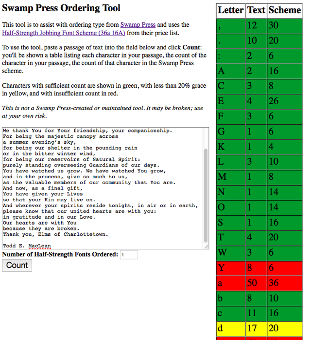

# Swamp Press Ordering Tool

This tool is to assist with ordering type from [Swamp Press](http://www.swamppress.com/) and uses the [Half-Strength Jobbing Font Scheme (36a 16A)](http://www.swamppress.com/Price_Schemes42010.pdf) from their price list.

To use the tool, paste a passage of text into the field below and click **Count**: you'll be shown a table listing each character in your passage, the count of the character in your passage, the count of that character in the Swamp Press scheme.

Characters with sufficient count are shown in green, with less than 20% grace in yellow, and with insufficient count in red.

*This is not a Swamp Press-created or maintained tool. It may be broken; use at your own risk.*

## Screen Shot

This screen shot shows the tool being used the order type for a poem.  It shows that if a single half-strength font is ordered, there will be insufficient **Y** and **a**, and only three **d** to spare.

